<!-- TODO: modify the background color -->

# CI/CD って何？  アプリ開発を効率化するはじめの一歩

<!--_class: lead -->

## Masaki Sato

# Masaki Sato / 佐藤将来

<!-- TODO: align on the left -->
<!-- TODO: add ice breaking intro -->

- Flutter エンジニア(フリーランス)
- Codemagic 日本語記事担当
- イベント運営
  - 東京Flutterハッカソン
  - FlutterGakkai
  - FlutterNinjas
- 好きな 🍜
  - 家系（武道家）
  - 鶏白湯（ようすけ）
  - つけ麺（武虎）

# 「CI/CD」を聞いたことある人？🤚
<!--_class: lead -->

# CI/CD を使っている人？🤚
<!--_class: lead -->

# はじめに

使ってない方 → 「へー、CI/CD 使ってみるのアリかも！」

使っている方 → 「改めて、CI/CD ってすごい！」

# CI/CD とは
<!-- TODO: add images of services -->

<!-- _footer: "出典: [ビジネス+IT](https://www.sbbit.jp/article/cont1/81640)" -->

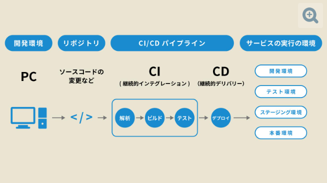

# CI について

<!-- _footer: "出典: [ビジネス+IT](https://www.sbbit.jp/article/cont1/81640)" -->

# 手動だと...

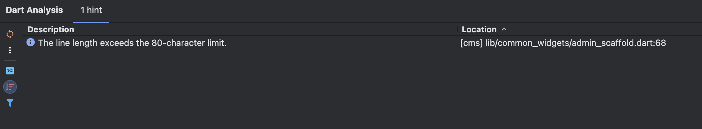

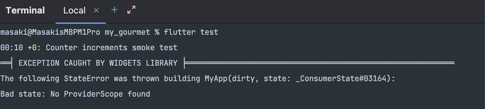

# CI だと...

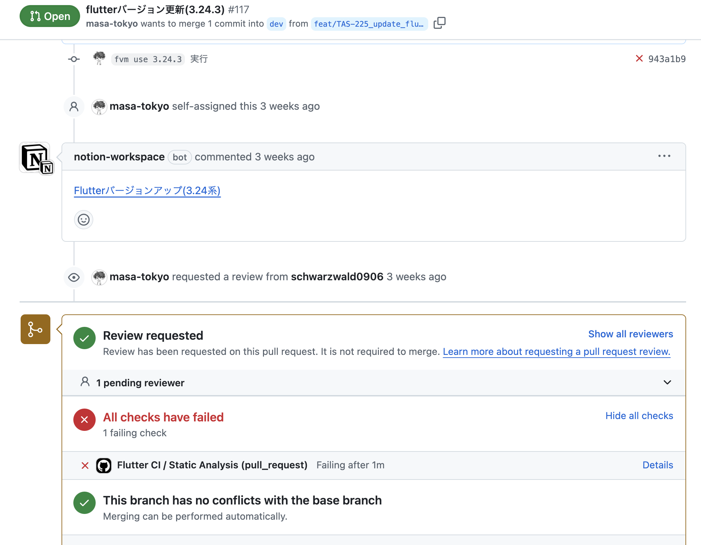

# CD とは

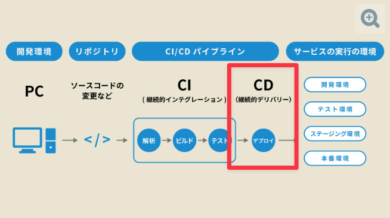

<!-- _footer: "出典: [ビジネス+IT](https://www.sbbit.jp/article/cont1/81640)" -->

# 手動だと...

#### コマンドラインでビルドして...

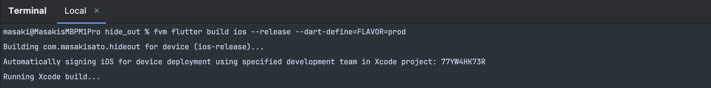

# 手動だと...

#### Xcodeで色々...

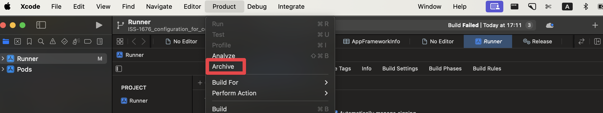

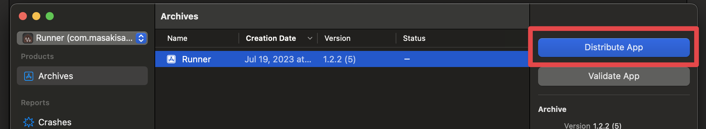

# CD だと...

#### ボタン一つで完了 🙌

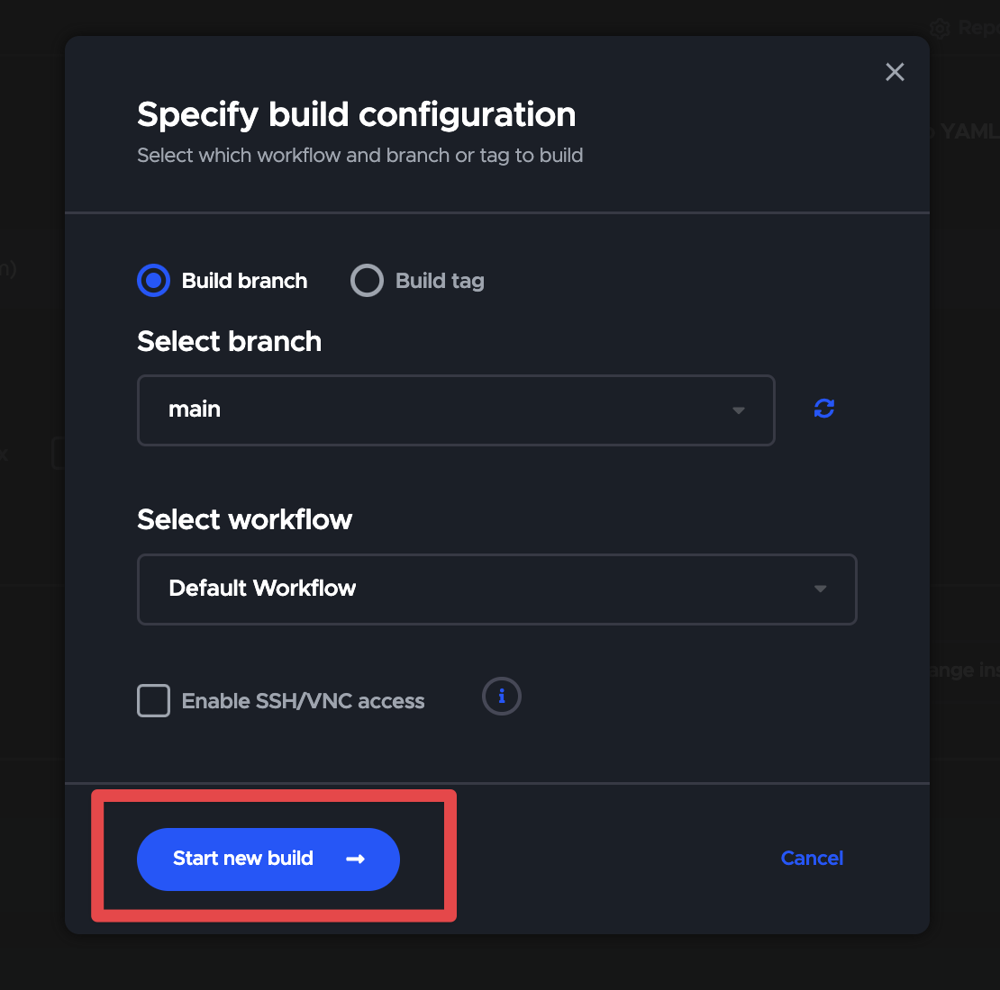

# CD だと...

#### PRと紐付けることも出来る！

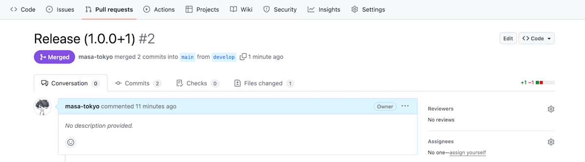

# 手動だと...

#### 環境の再現性がない...

- ソースコード
- ビルド引数
- ビルド環境
  - Flutter
  - Xcode
  - CocoaPods

# CD だと...

#### どのコミットがビルドされたのか記録が残る

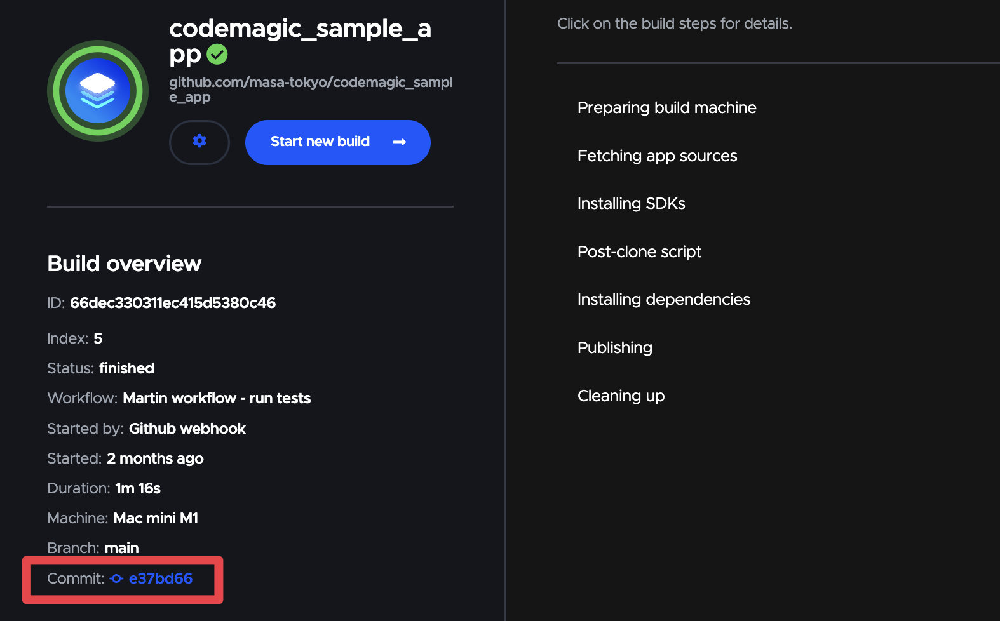

# CD だと...

#### 環境が固定出来る

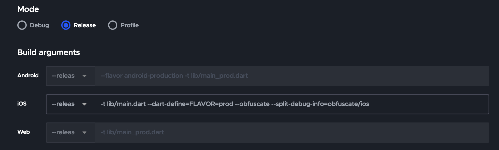

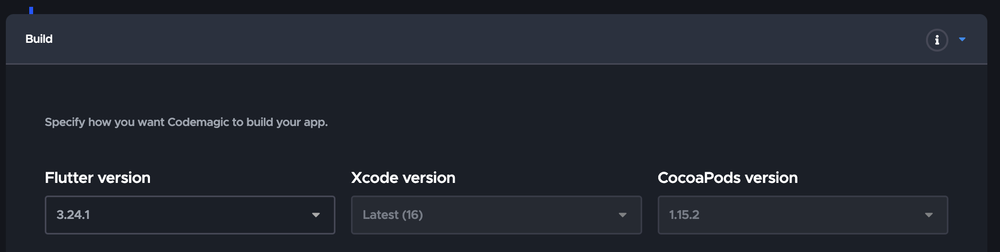

# CI/CD の恩恵

<!-- _footer: "*n=950 by [Rollbar Research: Traditional Error Monitoring Is Missing the Mark, 2021](https://www.businesswire.com/news/home/20210216005484/en/Rollbar-Research-Shows-That-Traditional-Error-Monitoring-Is-Missing-the-Mark)" -->

#### どのくらいの時間をバグ改修に使っていますか？

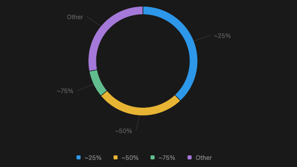

# CI/CD の恩恵

#### 1ヶ月に直すと...

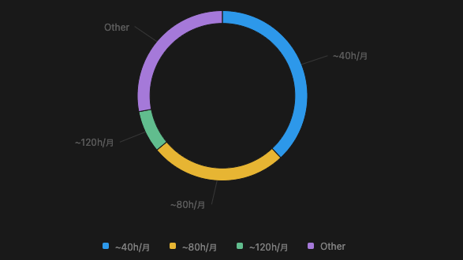

# CI/CD の恩恵

#### 人件費が5000円/時だとすると...

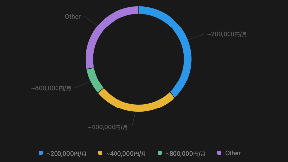

# CI/CD の恩恵

#### 会社に5人いたら...

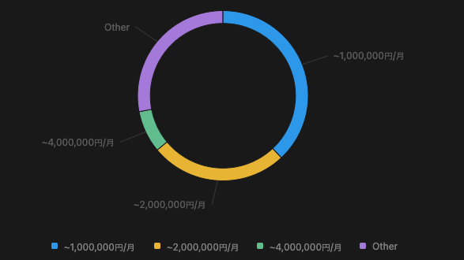

# 終わりに
<!-- TODO: show on the 1st screen -->

[CI/CD ツール(Codemagic) を使って Flutter アプリを App Store へ公開する](https://zenn.dev/codemagic/articles/3ade99d0485de4)

---
<!-- TODO: show entire screen -->

<!-- _header: "" -->

# Thank you!
<!--_class: lead -->